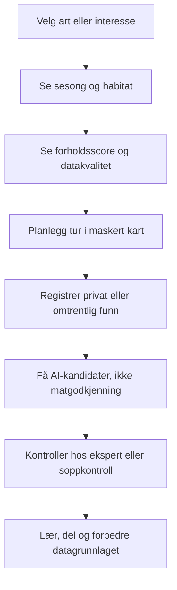

> ⚠️ **AVLØST 2. august 2026.** Denne rapporten ble skrevet mot branch-commit `c9ef78b`, ikke
> mot main, og en etterkontroll av alle 39 konkrete funn ga: 13 fortsatt sanne, 11 allerede
> fikset, 6 uverifiserbare, 2 utdaterte og **7 som aldri var sanne** — tre av dem med
> henvisninger til filer som ikke finnes. Beholdt som historikk og sammenligningsgrunnlag.
> Gjeldende revisjon: `docs/lanseringsrevisjon-funn.md`, `-inventar.md`, `-beslutning.md`.

# SoppJakt produkt V2 – roadmap

**Dato:** 1. august 2026  
**Mål:** gjøre SoppJakt til en trygg, troverdig og kommersielt levedyktig naturassistent for Norge, med Sverige som neste marked.

## Produktretning

SoppJakt bør ikke konkurrere om å være appen som «garanterer hvor soppen er» eller «godkjenner matsopp med AI». Den sterkeste og mest forsvarlige posisjonen er:

> **SoppJakt hjelper deg å forstå hva som kan finnes, når forholdene er gode, hvor habitatet passer, og hvordan funn skal kontrolleres trygt.**

Denne formuleringen beholder verdien av kart, miljødata og AI uten å love en vitenskapelig presisjon produktet ennå ikke kan dokumentere.

## Prinsipper for V2

1. **Sikkerhet før konvertering.** Ingen UI-komponent skal kunne tolkes som spisetillatelse.
2. **Forklarbar score før sannsynlighet.** Bruk «forholdsscore» til modellen er validert og kalibrert.
3. **Personvern som produktegenskap.** Hemmelige steder skal være trygge som standard.
4. **Gratis nytte, betalt beslutningsstøtte.** Artsdatabase, kalender, forum og maskert kart bygger nettverk; avansert planlegging kan være premium.
5. **Datakvalitet er synlig.** Kilde, alder, oppløsning og usikkerhet skal følge anbefalingen.
6. **Nordisk lokalitet.** Norske og svenske arter, værmønstre, kontrolltjenester, språk og regler prioriteres.

## Behold, endre og utsett

### Behold

- Artsdatabase med norske/latinske navn og forvekslingsarter.
- Privat, omtrentlig og offentlig funnsynlighet.
- Kalender, forum, funnlogg og kart.
- Kobling mellom miljøforhold og planlegging.
- Ekspert-/fellesskapsverifisering, men med tydelige nivåer.
- Freemium med en reell gratisopplevelse.

### Endre

- «Hotspot 82 %» til «Gode forhold · score 82/100» med datakvalitet.
- AI-resultat fra «spiselig + 92 %» til «mulig artskandidat · ikke matvurdert».
- Sesongpass til enten engangspass med sluttdato eller tydelig årlig abonnement.
- Kart fra innloggingsmur til offentlig maskert visning, dersom dette er valgt produktstrategi.
- Offline fra generell påstand til eksplisitte, testede funksjoner per plattform.

### Utsett

- Påstander om sanntids sannsynlighet for artsspesifikke funn.
- Salg av overskuddsfangst.
- Datakommercialisering mot forskning/skogbruk uten separat etisk og juridisk modell.
- Bred annonseplattform før tillit og retention er dokumentert.
- Automatisk «ekspertgodkjenning» uten organisert fagnettverk og ansvarslinjer.

## Målbilde for kjerneflyten

## Fase 0 – tillit og release-grunnmur

**Varighet:** 1–2 uker  
**Mål:** gjøre løsningen sikker nok for intern test og kontrollert demonstrasjon.

### Leveranser

- Endre all prediksjonstekst fra sannsynlighet/prosent til forholdsscore.
- Redesign AI-resultat slik at spiselighet ikke fremstår som godkjenning.
- Oppgrader sårbare produksjonsavhengigheter.
- Fiks lint, typecheck og testisolasjon.
- Del én sikker redirect-validator mellom callback, login og register.
- Dokumenter datakilder, modellversjon og oppdateringstid.
- Legg inn strukturert sikkerhetsinnhold fra fagansvarlig.

### Akseptansekriterier

- Ingen skjerm bruker formuleringen «trygg å spise» basert på AI.
- Ingen heuristisk verdi presenteres med prosenttegn.
- Build, typecheck, lint, test og dependency audit er grønne i ren CI.
- P0-funnene i `docs/technical-audit.md` er dokumentert lukket.

## Fase 1 – lukket feltbeta

**Varighet:** 3–5 uker  
**Mål:** bevise at kjerneproduktet hjelper brukere å planlegge og dokumentere turer.

### Leveranser

- Offentlig eller innlogget maskert kart, avklart som produktbeslutning.
- Stabil opprettelse av funn med privat som anbefalt standard.
- Artskalender med region, datakilde og sesongusikkerhet.
- Forholdsscore med forklaringskort: vær, habitat, fuktighet og datakvalitet.
- AI-kandidatflyt med ekspertlenke og giftberedskap.
- Feltlogging som fungerer ved ustabil dekning, med tydelig synkroniseringsstatus.
- Enkel feedback: «fant / fant ikke», tid brukt, habitat og valgfri art.
- Tilgjengelighet og mobiltest med reelle brukere.

### Betaoppsett

- 50–100 inviterte brukere.
- Blanding av nybegynnere, erfarne plukkere og soppsakkyndige.
- Norge: minst tre regioner og både bynær/distriktsbruk.
- Eksplisitt forsknings-/produktfeedbacksamtykke separat fra tjenestebruk.

### KPI-er

- Minst 60 % fullfører første turplanlegging.
- Minst 35 % registrerer ett funn eller negativ observasjon.
- Null hendelser der testperson oppfatter AI som matgodkjenning.
- Minst 70 % forstår forskjellen på forholdsscore og sannsynlighet.
- Median tid fra åpning til relevant kartområde under 30 sekunder.

## Fase 2 – offentlig gratisprodukt og premium-pilot

**Varighet:** 6–10 uker etter feltbeta  
**Mål:** etablere retention og betalingsvilje uten å overselge prediksjonen.

### Gratis

- Artsdatabase og søk.
- Sesongkalender.
- Forum og grunnleggende læring.
- Maskert funnkart.
- Begrenset antall AI-kandidatforslag.
- Privat funnlogg.

### Premium-pilot

- Flere lag i forholdskartet.
- Lagrede områder og varsler om forbedrede forhold.
- Nedlastbart/offline turgrunnlag i utvalgte områder.
- Dypere forklaring av habitat og miljøfaktorer.
- Eksport av egen tur- og funnhistorikk.
- Prioritert ekspertflyt bare dersom partner og kapasitet er avtalt.

### Betalingsmodell

Anbefalt test:

- Premium månedlig: 79 kr.
- Årlig: prisankring med tydelig rabatt.
- Sesongpass: engangskjøp, eksplisitt gyldig til dato, ingen skjult fornyelse.
- 7–14 dagers prøve kun hvis oppsigelse og fornyelse er helt tydelig.

### KPI-er

- 4-ukers retention over 20 % i sesong.
- Gratis til premium-konvertering 3–7 % i pilot.
- Refusjonsrate under 3 %.
- Supporthenvendelser om uklare score-/abonnementsvilkår under 1 % av betalende brukere.

## Fase 3 – validert prediksjon

**Varighet:** 10–20+ uker og minst én soppsesong  
**Mål:** avgjøre om forholdsscore kan utvikles til en kalibrert artssannsynlighet.

### Dataprotokoll

- Forhåndsdefiner arter, geografiske ruter, tidsvinduer og utfall.
- Skill positive funn fra systematisk registrerte negative observasjoner.
- Dedupliser bruker-, sted- og tidsavhengige observasjoner.
- Lag geografisk og tidsmessig holdout som modellen aldri trenes på.
- Spor skjevhet fra tilgjengelighet, populære turområder og aktive brukere.
- Versjoner alle features, datakilder og modellkjøringer.

### Minimum analyse

- Precision/recall og PR-AUC for sjeldne utfall.
- ROC-AUC som sekundær metrikk.
- Brier score og kalibreringskurve.
- Resultat per art, region, måned og datakvalitetsnivå.
- Sammenligning mot enkel baseline: sesong + nylig nedbør.
- Feltvalidering utført uten at testerne ser modellscoren.

### Go/no-go

Bruk sannsynlighetsbegrepet bare dersom modellen:

- slår en forhåndsdefinert enkel baseline,
- har stabil kalibrering i geografisk holdout,
- beholder akseptabel kvalitet på tvers av regioner,
- kan forklare datamangler og modellbegrensninger,
- er vurdert av relevant naturfaglig kompetanse.

Hvis ikke, behold produktet som en transparent forholds- og habitatassistent. Det kan fortsatt ha høy kommersiell verdi.

## Fase 4 – Sverige og bredere spiselig natur

**Varighet:** etter dokumentert norsk product-market fit  
**Mål:** utvide datamodell og innhold uten å svekke sikkerheten.

- Svenske artsnavn, Giftinformationscentralen og lokale kontrollressurser.
- Svenske vær-, skog-, jord- og terrengdata med egne lisenser/provenance.
- Regionbasert sesongmodell, ikke direkte kopiering av norsk kalender.
- Deretter modulær utvidelse til bær, ville vekster, tang/tare og nøtter.
- Hver kategori får egne eksperter, risikoregler og innholdsmodell.

## Team og ansvar

| Rolle | Hovedansvar |
|---|---|
| Produktansvarlig | Prioritering, kundeløfte, KPI og partnerskap. |
| Teknisk leder | Arkitektur, sikkerhet, CI/CD og kodekvalitet. |
| Soppsakkyndig/fagredaktør | Artsinnhold, forveksling, sikkerhetstekst og revisjon. |
| Data-/geospatial ansvarlig | Dataprovenance, scoremodell, validering og bias. |
| Personvern/juridisk | DPIA, samtykke, leverandøravtaler og forbrukervilkår. |
| UX/design | Feltbruk, tilgjengelighet, risikokommunikasjon og onboarding. |
| Drift/support | Hendelser, refusjon, sletting, moderering og beredskap. |

## Definisjon av ferdig

En funksjon er ikke ferdig før:

- produktkrav og sikkerhetskonsekvens er dokumentert,
- server- og databaseautorisasjon er testet,
- personvern og dataminimering er vurdert,
- mobil, dårlig nett og tilgjengelighet er testet,
- logging ikke inneholder unødvendig PII,
- testene er grønne i ren CI,
- brukerrettet tekst beskriver begrensninger korrekt,
- support og rollback er definert.

