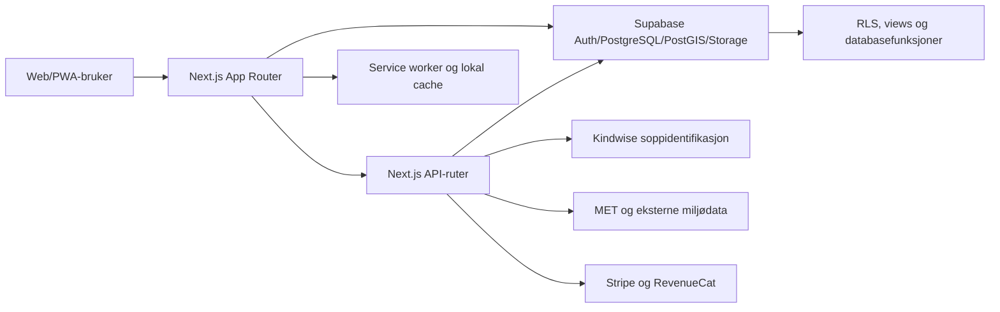

> ⚠️ **AVLØST 2. august 2026.** Denne rapporten ble skrevet mot branch-commit `c9ef78b`, ikke
> mot main, og en etterkontroll av alle 39 konkrete funn ga: 13 fortsatt sanne, 11 allerede
> fikset, 6 uverifiserbare, 2 utdaterte og **7 som aldri var sanne** — tre av dem med
> henvisninger til filer som ikke finnes. Beholdt som historikk og sammenligningsgrunnlag.
> Gjeldende revisjon: `docs/lanseringsrevisjon-funn.md`, `-inventar.md`, `-beslutning.md`.

# SoppJakt teknisk revisjon

**Dato:** 1. august 2026  
**Revisjonsgrunnlag:** branch `feat/ga4-pwa`, commit `c9ef78b`  
**Omfang:** produkt, UX, matsikkerhet, prediksjon, kart/personvern, autentisering, database/RLS, API-er, betaling, GDPR, PWA/offline, ytelse, test, avhengigheter og drift.

## Konklusjon

SoppJakt har en tydelig posisjon, en omfattende funksjonell grunnmur og et uvanlig sterkt produktkonsept: artskunnskap, funn, fellesskap og datadrevet turplanlegging i samme tjeneste. Kodebasen viser at mye mer enn en prototype er bygget, blant annet autentisering, soppdatabase, kart, forum, AI-identifikasjon, prediksjonsendepunkt, betaling og personvernfunksjoner.

Appen er likevel **ikke klar for bred offentlig lansering som beslutningsstøtte for matsopp eller som betalt prediksjonstjeneste**. De viktigste årsakene er:

1. En heuristisk prediksjonsscore presenteres som prosent uten dokumentert kalibrering eller tilfredsstillende validering.
2. AI-resultater og spiselighetsmerking kan samlet oppfattes som en mattrygghetsbekreftelse.
3. Produksjonsavhengigheter har kjente alvorlige sårbarheter, inkludert rammeverksrelaterte middleware-problemer.
4. Sletting, eksport, posisjonsdeling og enkelte databasevisninger trenger en strengere personvern- og sikkerhetsmodell.
5. Kvalitetsportene er ikke pålitelige: produksjonsbygg består, men typekontroll, lint, testisolasjon og avhengighetskontroll har avvik.

**Anbefalt status:** kontrollert, lukket betatest etter at P0-funnene er lukket. Ikke markedsfør kartscore som sannsynlighet eller AI som spiselighetskontroll før faglig validering og juridisk gjennomgang er fullført.

## Samlet vurdering

| Område | Vurdering | Kommentar |
|---|---:|---|
| Produktidé og differensiering | 7/10 | Sterk helhet og tydelig nordisk nisje. Prediksjon er attraktiv, men må bevises. |
| Arkitektur | 6/10 | Fornuftig Next.js/Supabase-struktur, men flere serverless- og driftsmekanismer er foreløpig prosesslokale. |
| Matsikkerhet | 4/10 | Gode advarsler og farlige forvekslingsarter, men UI-et kan fortsatt tolkes som godkjenning. |
| Personvern og GDPR | 5/10 | Synlighetsnivåer, maskering, eksport og sletting finnes, men viktige kanttilfeller gjenstår. |
| Autentisering og applikasjonssikkerhet | 5/10 | Servervalidering finnes, men redirect, feilbehandling og avhengigheter må strammes inn. |
| Prediksjonsvitenskap | 3/10 | Transparent heuristikk, men utilstrekkelig kalibrering og dokumentert feltvalidering. |
| Betaling | 5/10 | Stripe/RevenueCat-grunnmur finnes; idempotens, entitlement og produktsemantikk må forsterkes. |
| PWA/offline/mobil | 4/10 | Manifest/service worker finnes, men kjerneflyter er ikke reelt offline-klare. |
| Test og kodekvalitet | 5/10 | Stor testmengde, men dagens test- og lintoppsett kan ikke brukes som stabil release gate. |
| Lanseringsberedskap | 4/10 | Egnet for intern demonstrasjon og kontrollert beta etter P0-lukking. |

## Arkitektur

Arkitekturen er hensiktsmessig for MVP og tidlig vekst. Før større lansering bør prosesslokal tilstand flyttes til delte, atomiske mekanismer, og alle sikkerhetskritiske beslutninger bør håndheves på server/database, ikke i én Node-prosess.

## Funn

### P0 – lanseringsblokkere

#### P0-1: Heuristisk score presenteres som prosent uten gyldig sannsynlighetsgrunnlag

- **Evidens:** `src/lib/prediction/cell-score.ts:86`, `src/lib/prediction/cell-score.ts:135`, `src/lib/prediction/cell-score.ts:149`, `src/components/map/MushroomMap.tsx:166`, `src/components/map/MushroomMap.tsx:191`.
- Scoren er en vektet 0–100-modell. Historisk forekomst er deaktivert etter dokumentert AUC på omtrent 0,472, mens manglende terrengdata behandles nøytralt. Kartet viser likevel `Hotspot ...%`.
- **Konsekvens:** Brukere og betalende kunder kan tolke tallet som kalibrert sannsynlighet for å finne sopp. Det gir produkt-, omdømme- og mulig markedsføringsrettslig risiko.
- **Krav før lansering:** Kall verdien «forholdsscore» eller «habitatscore», fjern prosenttegn, vis datakvalitet og siste oppdatering, og dokumenter modellversjon. Sannsynlighet kan først brukes etter forhåndsdefinert valideringsprotokoll, holdout-data, feltvalidering og kalibreringsanalyse.

#### P0-2: AI-resultat og spiselighetsmerking kan oppfattes som mattrygghetsgodkjenning

- **Evidens:** `src/app/api/identify/route.ts:334`, `src/components/identify/IdentifyResult.tsx:49`, `src/components/identify/IdentifyResult.tsx:53`, `src/components/identify/SafetyWarning.tsx:15`.
- API-et rangerer forslag og UI-et kombinerer konfidensprosent med spiselighetsbadge. Advarselen er nyttig, men den visuelle hovedbeskjeden kan fortsatt bli «92 % + spiselig».
- **Konsekvens:** Feilidentifikasjon kan føre til forgiftning. Helsenorge sier uttrykkelig at kunstig intelligens aldri skal brukes til å bestemme sopp som skal brukes til mat.
- **Krav før lansering:** Vis «ikke vurdert som mat» som standard, fjern spiselighetsbadge fra AI-resultatlisten, og krev separat artsoppslag/ekspertkontroll. Integrer tydelig lenke til digital soppkontroll og nødveiledning. Gjennomfør sikkerhets- og innholdsgodkjenning med soppsakkyndig.
- **Kilde:** [Helsenorge – unngå soppforgiftning](https://www.helsenorge.no/giftinformasjon/sopp/unnga-soppforgiftning/).

#### P0-3: Produksjonsavhengigheter har kjente alvorlige sårbarheter

- **Evidens:** `package.json:48`, `package.json:50`, samt `npm audit --omit=dev --json` kjørt under revisjonen.
- Revisjonen fant tre sårbarheter med høy alvorlighetsgrad, knyttet til Next.js, PostCSS og Sharp. Next.js-funnene omfatter blant annet middleware/proxy-bypass og tjenestenekt i berørte versjoner.
- **Konsekvens:** Autentiseringsbeskyttede ruter kan få redusert sikkerhetsmargin, og bilde-/byggekjeden kan eksponeres for kjente feil.
- **Krav før lansering:** Oppgrader til versjoner som `npm audit` markerer som rettet, vurder breaking changes, kjør full regresjon og lås eksakte, reproduserbare produksjonsversjoner. Innfør Dependabot/Renovate og obligatorisk audit i CI.

### P1 – må lukkes før offentlig beta eller betaling

#### P1-1: Kontosletting kan ende i delvis, irreversibel tilstand

- **Evidens:** `src/app/api/me/delete/route.ts:130`, `src/app/api/me/delete/route.ts:150`, `src/app/api/me/delete/route.ts:167`, `src/app/api/me/delete/route.ts:182`.
- Positive funn og private negative observasjoner slettes før Auth-brukeren slettes. Hvis siste steg feiler, er deler av dataene borte mens kontoen består. Offentlige/omtrentlige negative observasjoner beholdes anonymisert.
- **Konsekvens:** Uforutsigbar brukerrettighet, supportbelastning og mulig avvik fra oppgitt personverninformasjon.
- **Tiltak:** Bruk en sporbar slettingsjobb med tilstandsmaskin, idempotente steg og eksplisitt retention-policy. Dokumenter nøyaktig hvilke anonymiserte data som beholdes og hvorfor. Ikke logg bruker-ID unødvendig.

#### P1-2: Eksakte koordinater sendes til tredjepart ved identifikasjon

- **Evidens:** `src/app/api/identify/route.ts:145`, `src/app/api/identify/route.ts:162`.
- Ruten kan sende brukerens eksakte latitude/longitude til Kindwise, i konflikt med produktpåstanden om deling på bynivå.
- **Konsekvens:** Lokasjonsdata kan avsløre bevegelse og hemmelige soppsteder. Behandlingsgrunnlag, informasjon og databehandlerforhold må være presise.
- **Tiltak:** Ikke send koordinater som standard. Kvantiser på server til grov rute/region etter eksplisitt samtykke, dokumenter tredjepart og lagre samtykkeversjon.

#### P1-3: Innloggings- og registreringssidene kan utføre klientstyrt redirect

- **Evidens:** `src/app/auth/login/page.tsx:19`, `src/app/auth/login/page.tsx:39`, `src/app/auth/register/page.tsx:44`, `src/app/auth/register/page.tsx:84`.
- Callback-ruten har sikker sti-normalisering, men klientrutene leser `next`/`redirect` og sender verdien til router uten samme validering.
- **Konsekvens:** Åpen redirect kan brukes i phishing og svekke tilliten til domenet.
- **Tiltak:** Del én `getSafeNext()`-funksjon mellom middleware, callback, login og register. Tillat bare relative interne stier; avvis `//`, skjema og kontrolltegn. Legg til dedikerte sikkerhetstester.

#### P1-4: Rate limiting og idempotens er prosesslokalt

- **Evidens:** `src/app/api/identify/route.ts:66`, `src/app/api/prediction/route.ts:107`, `src/app/api/billing/checkout/route.ts:34`, `src/app/api/me/delete/route.ts:62`.
- Minnebaserte tellere resettes ved cold start og deles ikke mellom serverless-instansene. Checkout-idempotens er knyttet til et tidsvindu i stedet for en varig operasjonsnøkkel.
- **Konsekvens:** Kvoter, kostnadskontroll og misbruksvern kan omgås; doble betalingsressurser kan oppstå.
- **Tiltak:** Bruk Redis/databasebasert rate limit med atomiske operasjoner. Bruk unik klient-/ordre-ID som Stripe-idempotensnøkkel og vedvarende operasjonslogg.

#### P1-5: Offentlig funnvisning bruker privilegert view-semantikk

- **Evidens:** `supabase/migrations/029_findings_context.sql:48`, `supabase/migrations/029_findings_context.sql:84`.
- Viewet er deklarert med `security_invoker=false` og gis til `anon` og `authenticated`. Maskeringen ser tilsiktet ut, men fremtidige kolonneendringer kan utvide eksponeringen uten RLS-beskyttelse.
- **Konsekvens:** En senere migrasjon kan lekke rå posisjon eller brukerdata.
- **Tiltak:** Bruk `security_invoker=true` der mulig, eller en eksplisitt, smal `SECURITY DEFINER`-funksjon med fast `search_path`, eksplisitte kolonner og regresjonstester for alle synlighetsnivåer.
- **Kilde:** [Supabase – Row Level Security og views](https://supabase.com/docs/guides/database/postgres/row-level-security).

#### P1-6: Gratis kart er i praksis autentiseringsbeskyttet

- **Evidens:** `src/lib/supabase/middleware.ts:7`.
- Hele `/map` står i listen over beskyttede ruter, mens produktmodellen lover grunnleggende kart i gratisnivået.
- **Konsekvens:** Brudd mellom markedsføring, onboarding og faktisk funksjon; dårligere konvertering og SEO/deling.
- **Tiltak:** Bestem produktregelen eksplisitt. Anbefaling: offentlig, maskert lesekart; innlogging ved lagring, private funn og premiumlag.

#### P1-7: Sesongpass er implementert som årlig auto-fornyelse

- **Evidens:** `src/lib/billing/plans.ts:19`, `src/app/api/billing/checkout/route.ts:72`.
- «Sesongpass» til 249 kr er en årlig abonnementspris, ikke et tidsavgrenset engangspass.
- **Konsekvens:** Betalingsopplevelsen kan avvike fra brukerens forventning og skape refusjoner/forbrukerrettslig risiko.
- **Tiltak:** Velg én tydelig modell: engangskjøp med eksplisitt sluttdato eller årlig abonnement med svært tydelig fornyelsesinformasjon og påminnelse.

#### P1-8: Offline-løftet støttes ikke av dagens service worker

- **Evidens:** `public/sw.js:8`, `public/sw.js:80`, `public/sw.js:93`, `public/sw.js:100`.
- `/map` precaches selv om ruten krever auth; navigasjoner hoppes over, og statisk cache har ikke tydelig utløp eller kvotestyring.
- **Konsekvens:** Brukeren kan installere PWA-en, men mister kjernefunksjon i skogen. Ubegrenset cache kan bli foreldet eller vokse.
- **Tiltak:** Definer en eksplisitt offline-matrise, cache en trygg app-shell, nedlastbare kartområder og lokal funnkø. Vis sist synkronisert og konfliktstatus. Ikke lov offline-identifikasjon uten lokal modell/data.

#### P1-9: Testløpet er forurenset av lokale worktrees

- **Evidens:** `vitest.config.ts:9`, samt revisjonskjøringen av `npm test -- --run`.
- Vitest samlet inn tester under `.claude/worktrees/**`. Resultatet var 299 filer, 2938 tester og 14 feil, hvor flere feil kom fra utdaterte worktree-kopier.
- **Konsekvens:** CI- og lokalstatus blir upålitelig; reelle regresjoner kan skjules i støy.
- **Tiltak:** Ekskluder `.git`, `.claude`, `android`, `.next`, `node_modules` og genererte mapper eksplisitt. Kjør hovedsuite og integrasjonstester separat.

#### P1-10: Lint og typekontroll fungerer ikke som release gates

- **Evidens:** `package.json:9`; genererte dubletter i `.next/types/cache-life.d 3.ts` og `.next/types/routes.d 3.ts` under revisjonen.
- `npm run lint` feiler fordi `next lint` ikke støttes av installert Next.js. `npm run typecheck` feiler på dupliserte `.next`-artefakter.
- **Konsekvens:** Teamet mangler stabile, automatiserte kvalitetsporter.
- **Tiltak:** Konfigurer ESLint direkte, fjern/unngå synkroniseringsdubletter i `.next`, slett generert build-cache i CI og verifiser typekontroll fra ren checkout.

### P2 – planlagt kvalitetsforbedring

#### P2-1: API-feil kan eksponere interne detaljer

- **Evidens:** `src/app/api/billing/checkout/route.ts:131`, `src/app/api/billing/portal/route.ts:52`, `src/app/api/me/export/route.ts:50`, `src/app/api/me/delete/route.ts:143`.
- Flere ruter returnerer eller logger rå database-/leverandørfeil og identifikatorer.
- **Tiltak:** Returner stabile offentlige feilkoder, korrelasjons-ID og generisk tekst. Send detaljer kun til strukturert, tilgangsstyrt observability med PII-redigering.

#### P2-2: Dataeksport kan fremstå komplett selv om delspørringer feiler

- **Evidens:** `src/app/api/me/export/route.ts:50`, `src/app/api/me/export/route.ts:74`, `src/app/api/me/export/route.ts:101`.
- Individuelle spørringsfeil håndteres ikke samlet, og kontaktadressen er hardkodet.
- **Tiltak:** Fail closed ved manglende datasett, legg ved eksportmanifest og genereringstid, bruk konfigurert personvernkontakt og støtt maskinlesbart standardformat.
- **Kilde:** [Datatilsynet – rett til dataportabilitet](https://www.datatilsynet.no/rettigheter-og-plikter/den-registrertes-rettigheter/rett-til-dataportabilitet/retten-til-dataportabilitet/nar-har-den-enkelte-rett-til-dataportabilitet/).

#### P2-3: Tredjeparts- og værdata trenger tydelig provenance

- **Evidens:** eksterne vær- og prediksjonskall i `src/app/api/prediction/route.ts:127`.
- **Tiltak:** Vis datakilde, observasjonstid, modellversjon, oppløsning og usikkerhet i produktet. Bruk identifiserbar User-Agent og følg leverandørvilkår.
- **Kilde:** [MET Weather API – Terms of Service](https://api.met.no/doc/TermsOfService).

#### P2-4: CSP tillater inline script/style

- **Evidens:** `next.config.js:23`, `next.config.js:27`.
- **Tiltak:** Gå mot nonce/hash-basert CSP og mål reduksjon av `unsafe-inline`. Test tredjepartsintegrasjoner i report-only før håndheving.

## Personvern og matsikkerhet

### Posisjonsdata

Posisjon er sentralt for produktet og må behandles som sensitiv kontekst, selv når den ikke er en særskilt kategori etter GDPR. En robust modell bør være:

- `private`: eksakt posisjon tilgjengelig bare for eier.
- `approximate`: stabil, servergenerert maskering som ikke kan gjennomsnittberegnes tilbake gjennom gjentatte kall.
- `public`: brukeren må aktivt velge eksakt deling og få tydelig konsekvensforklaring.
- Tredjepart: ingen eksakt posisjon uten separat, informert og dokumentert samtykke.
- Eksport/sletting: alle posisjonskopier, thumbnails, logger og leverandørreferanser må inngå i datakartet.

Datatilsynet fremhever aktivt samtykke for appbruk av lokasjonsdata i sin appveiledning: [Datatilsynet – hva vet appen om deg?](https://www.datatilsynet.no/globalassets/global/dokumenter-pdfer-skjema-ol/regelverk/veiledere/app_rapport_dt2011.pdf).

### Soppidentifikasjon

Minimum sikkerhetsdesign:

1. AI foreslår kandidater, aldri «trygg å spise».
2. Giftige forvekslingsarter vises før spiselighetsinformasjon.
3. Manglende sikkerhetsdata behandles som ukjent/høy risiko.
4. Brukeren kan sende til kvalifisert kontroll uten å tolke AI-resultatet som godkjenning.
5. Giftinformasjonen `22 59 13 00` og `113` ved alvorlige symptomer vises i relevant kontekst.
6. Alt faginnhold har kilde, kontrollør, versjon og revisjonsdato.

## Verifikasjon utført

| Kontroll | Resultat | Kommentar |
|---|---|---|
| `npm run build` | Bestått | Next.js-produksjonsbygg fullførte, 48 ruter generert. |
| `npm run typecheck` | Feilet | Dupliserte genererte `.next/types/* d 3.ts`-filer. |
| `npm run lint` | Feilet | `next lint` er ikke gyldig med installert Next.js. |
| `npm test -- --run` | Feilet | 2924 bestått, 14 feilet; suite inkluderer utdaterte `.claude/worktrees`. |
| `npm audit --omit=dev --json` | Feilet | Tre sårbarheter med høy alvorlighetsgrad. |

Produksjonsbygget viser at applikasjonen kan kompileres. Det erstatter ikke fungerende type-, lint-, sikkerhets- og testporter.

## Lanseringsporter

### Før lukket beta

- Lukk P0-1, P0-2 og P0-3.
- Stabiliser lint, typecheck og testisolasjon.
- Test RLS og posisjonsmaskering med anon/eier/annen bruker/service role.
- Gjennomfør trusselmodell for auth, kart, opplasting, betaling og admin.
- Godkjenn sikkerhetstekster og artsinnhold med soppsakkyndig.

### Før offentlig gratislansering

- Lukk P1-1 til P1-5 og P1-8.
- Fullfør DPIA/personvernkartlegging for posisjon, bilder, AI og analyse.
- Dokumenter support, hendelseshåndtering, sletting og databrudd.
- Kjør tilgjengelighetstest mot WCAG 2.2 AA og reelle mobile enheter.

### Før betaling/premium

- Lukk P1-6 og P1-7.
- Verifiser entitlement på tvers av Stripe, RevenueCat, refusjon og utløp.
- Dokumenter hva kunden kjøper, scorebegrensninger og oppdateringsfrekvens.
- Gjennomfør feltpilot og måling av produktverdi før prediksjon markedsføres som premium-USP.

## Styrker som bør beholdes

- Samlet produkt rundt artskunnskap, kart, kalender, fellesskap og turplanlegging.
- Databasestruktur med PostGIS, synlighetsnivåer og eksplisitte RLS-migrasjoner.
- Forsøk på konservativ rangering og visning av farlige forvekslingsarter.
- Eksisterende eksport-, slettings-, betalings- og modereringsgrunnmur.
- Stor testbase og tydelig modulstruktur.
- Norsk produktfokus med realistisk mulighet for nordisk ekspansjon.

